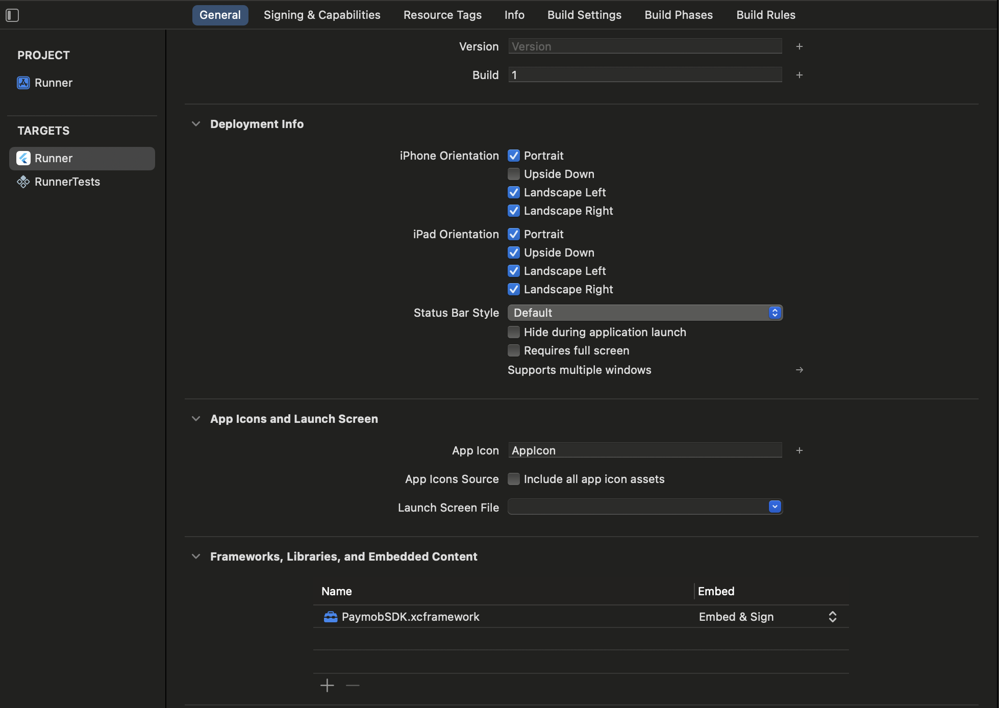
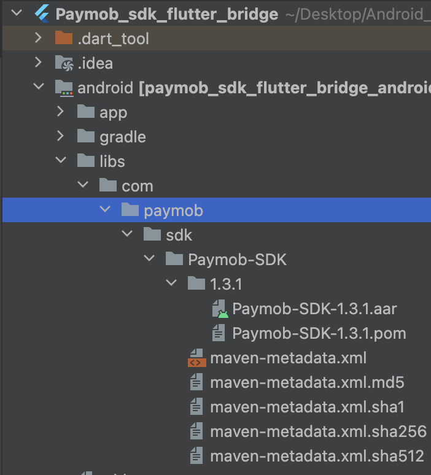
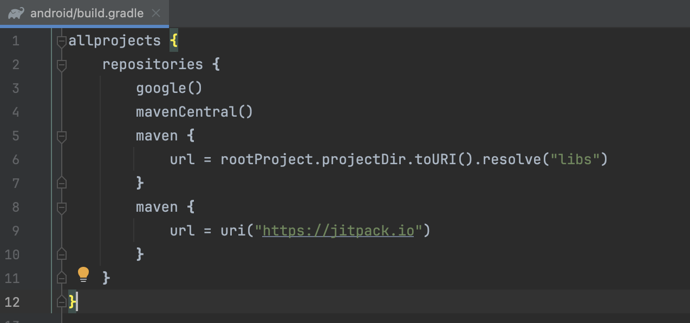
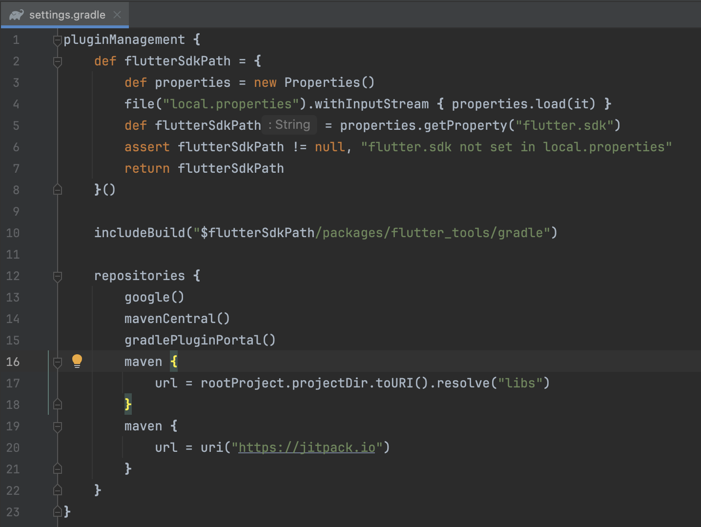
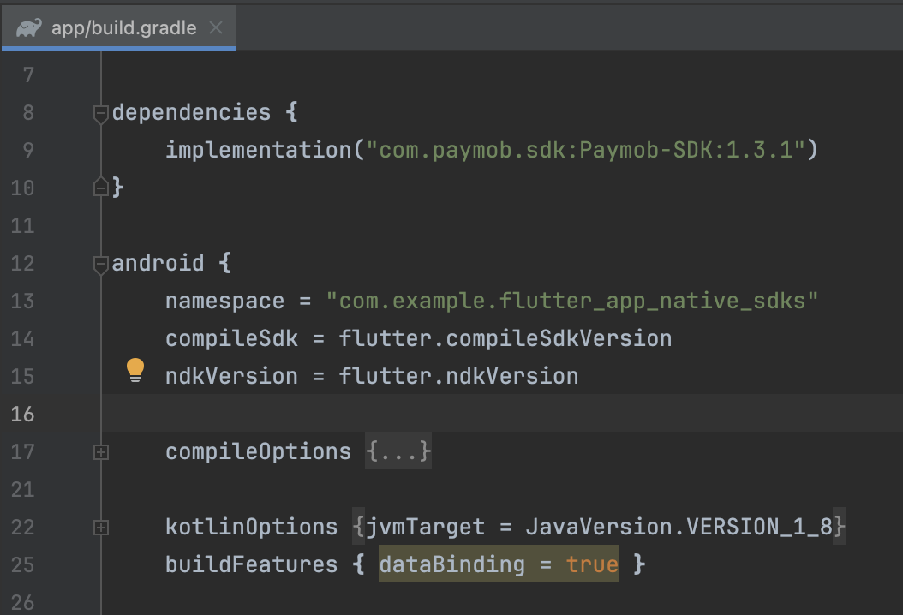

# PaymobSDK_FlutterBridge

A Demo App to show how to use native PaymobSDKs in your flutter project

## Usage

### Dart Section

Create a new class for Saved Cards if you plan on saving  cards used in Cards Payment Integrations and add the following code in it

```dart
enum CardType{OmanNet, JCB, Meeza, Maestro, Amex, Visa, MasterCard}

class SavedBankCard {
  final String token;
  final String maskedPanNumber;
  final String cardType;

  SavedBankCard({required this.token, required this.maskedPanNumber, required this.cardType});

  // Convert the custom CardType class to a Map (which can be serialized to JSON)
  Map<String, dynamic> toMap() {
    return {
      'token': token,
      'maskedPanNumber': maskedPanNumber,
      'cardType': cardType,
    };
  }
}
```

Redirect into you dart file.\
import the following dependency.

```dart
import 'package:flutter/services.dart';
```
Then add the following code to the same file.

This is the function that you will call in your dart file when you need to call the sdk.

You need to pass the public and client secret keys to this function, These two parameters are required.\
The other Parameters are optional.


```dart
    static const methodChannel = MethodChannel('paymob_sdk_flutter');

  // Method to call native PaymobSDKs
  Future<void> _payWithPaymob(
      String pk,
      String csk,
      { SavedBankCard? savedCard,
        String? appName,
        Color? buttonBackgroundColor,
        Color? buttonTextColor,
        bool? saveCardDefault,
        bool? showSaveCard} ) async {

    try {
      final String result = await methodChannel.invokeMethod('payWithPaymob', {
        "publicKey": pk,
        "clientSecret": csk,
        "savedBankCard": savedCard?.toMap(),
        "appName": appName,
        "buttonBackgroundColor": buttonBackgroundColor?.value,
        "buttonTextColor": buttonTextColor?.value,
        "saveCardDefault": saveCardDefault,
        "showSaveCard": showSaveCard
      });
      print('Native result: $result');
      switch (result) {
        case 'Successfull':
          print('Transaction Successfull');
          // Do something for accepted
          break;
        case 'Rejected':
          print('Transaction Rejected');
          // Do something for rejected
          break;
        case 'Pending':
          print('Transaction Pending');
          // Do something for pending
          break;
        default:
          print('Unknown response');
      // Handle unknown response
      }
    } on PlatformException catch (e) {
      print("Failed to call native SDK: '${e.message}'.");
    }
  }
```

The following are optional Parameters that are used to customize the SDK
```dart
// the extra UI Customization parameters are

//sets the header to be the name you want
appName

//changes the color of the buttons throughout the SDK, the default is black
buttonBackgroundColor

//changes the color of the buttons Texts throughout the SDK, the default is white
buttonTextColor

//set save card checkbox initial value
saveCardDefault

//set whether or not should show save card checkbox
showSaveCard
```

### IOS Section

Redirect into you IOS Folder.


Place the IOS native sdk in this folder\
In the Settings of your project, scroll down to 'Frameworks, Libraries, and Embedded Content', then add the xcframework file there.



Then in you AppDelegate file.\
Add the following import

```swift
import PaymobSDK
```

Then create a global variable

```swift
    var SDKResult: FlutterResult?
```

Then add the following code to handle   receiving a call from the dart file

```swift
        let controller : FlutterViewController = window?.rootViewController as! FlutterViewController
        let nativeChannel = FlutterMethodChannel(name: "paymob_sdk_flutter",
                                                 binaryMessenger: controller.binaryMessenger)
        
        
        nativeChannel.setMethodCallHandler { (call: FlutterMethodCall, result: @escaping FlutterResult) -> Void in
            if call.method == "payWithPaymob",
               let args = call.arguments as? [String: Any]{
                self.SDKResult = result
                
                self.callNativeSDK(arguments: args, VC: controller)
            } else {
                result(FlutterMethodNotImplemented)
            }
        }

```

Then add the following code to handle calling the native PaymobSDK

```swift
    // Function to call native PaymobSDK
      private func callNativeSDK(arguments: [String: Any], VC: FlutterViewController) {
          
          // Initialize Paymob SDK
          let paymob = PaymobSDK()
          var savedCards:[SavedBankCard] = []
          paymob.delegate = self
          
          //customize the SDK
          if let appName = arguments["appName"] as? String{
              paymob.paymobSDKCustomization.appName = appName
          }
          if let buttonBackgroundColor = arguments["buttonBackgroundColor"] as? NSNumber{
              
              let colorInt = buttonBackgroundColor.intValue
              let alpha = CGFloat((colorInt >> 24) & 0xFF) / 255.0
              let red = CGFloat((colorInt >> 16) & 0xFF) / 255.0
              let green = CGFloat((colorInt >> 8) & 0xFF) / 255.0
              let blue = CGFloat(colorInt & 0xFF) / 255.0
              
              let color = UIColor(red: red, green: green, blue: blue, alpha: alpha)
              
              paymob.paymobSDKCustomization.buttonBackgroundColor = color
          }
          if let buttonTextColor = arguments["buttonTextColor"] as? NSNumber{
              
              let colorInt = buttonTextColor.intValue
              let alpha = CGFloat((colorInt >> 24) & 0xFF) / 255.0
              let red = CGFloat((colorInt >> 16) & 0xFF) / 255.0
              let green = CGFloat((colorInt >> 8) & 0xFF) / 255.0
              let blue = CGFloat(colorInt & 0xFF) / 255.0
              
              let color = UIColor(red: red, green: green, blue: blue, alpha: alpha)
              
              paymob.paymobSDKCustomization.buttonTextColor = color
          }
          if let saveCardDefault = arguments["saveCardDefault"] as? Bool{
              paymob.paymobSDKCustomization.saveCardDefault = saveCardDefault
          }
          if let showSaveCard = arguments["showSaveCard"] as? Bool{
              paymob.paymobSDKCustomization.showSaveCard = showSaveCard
          }
          
                   
          if let savedCardData = arguments["savedBankCard"] as? [String: String],
             let token = savedCardData["token"],
             let maskedPanNumber = savedCardData["maskedPanNumber"],
             let cardType = savedCardData["cardType"] {

              // Now you can create a custom class in Swift
              let savedcard = SavedBankCard(token: token, maskedPanNumber: maskedPanNumber, cardType: CardType(rawValue: cardType) ?? CardType.Unknown)
              
              savedCards.append(savedcard)
          }
          
          // Call Paymob SDK with publicKey and clientSecret
          if let publicKey = arguments["publicKey"] as? String,
             let clientSecret = arguments["clientSecret"] as? String{
              do{
                  try paymob.presentPayVC(VC: VC, PublicKey: publicKey, ClientSecret: clientSecret, SavedBankCards: savedCards)
              } catch let error {
                  print(error.localizedDescription)
              }
              return
          }
      }
```

Then add the following in the bottom to handle the result of the SDK

```swift
extension AppDelegate: PaymobSDKDelegate{
    public func transactionRejected() {
        self.SDKResult?("Rejected")
    }
    
    public func transactionAccepted() {
        self.SDKResult?("Successfull")
    }
    
    public func transactionPending() {
        self.SDKResult?("Pending")
    }
}
```

### Android Section

Redirect into the android directory.

Then create a new directory there calles 'libs' and place the Android SDK there



Inside the root android directory, open the build.gradle,\
then add the following code inside

```kotlin
allprojects {
    repositories {
        ...
        maven {
            url = rootProject.projectDir.toURI().resolve("libs")
        }
        maven {
            url = uri("https://jitpack.io")
        }
    }
}

```
should look like this



Then open the settings.gradle,\
then add the following code

```kotlin
pluginManagement {
    repositories {
        ...
        maven {
            url = rootProject.projectDir.toURI().resolve("libs")
        }
        maven {
            url = uri("https://jitpack.io")
        }

```
should look like this



Inside the app directory, open the build.gradle file and add the following

```kotlin
dependencies {
    implementation("com.paymob.sdk:Paymob-SDK:1.3.1")
}

android {
    ...
    buildFeatures { dataBinding = true }
}
```
should looke like this



Then in the MainActivity
add the following:

```kotlin
import android.graphics.Color
import android.util.Log
import io.flutter.plugin.common.MethodCall
import io.flutter.plugin.common.MethodChannel
import io.flutter.plugin.common.MethodChannel.MethodCallHandler
import io.flutter.plugin.common.MethodChannel.Result
import io.flutter.embedding.android.FlutterActivity
import android.os.Bundle
import android.widget.Toast

import com.paymob.paymob_sdk.PaymobSdk
import com.paymob.paymob_sdk.domain.model.CreditCard
import com.paymob.paymob_sdk.domain.model.SavedCard
import com.paymob.paymob_sdk.ui.PaymobSdkListener

class MainActivity: FlutterActivity(), MethodCallHandler, PaymobSdkListener {
    private val CHANNEL = "paymob_sdk_flutter"
    private var SDKResult: MethodChannel.Result? = null


    override fun onCreate(savedInstanceState: Bundle?) {
        super.onCreate(savedInstanceState)

        flutterEngine?.dartExecutor?.binaryMessenger?.let {
            MethodChannel(it, CHANNEL).setMethodCallHandler { call, result ->
                if (call.method == "payWithPaymob") {
                    SDKResult = result
                    callNativeSDK(call)
                } else {
                    result.notImplemented()
                }
            }
        }
    }

    // Function to call native PaymobSDK
    private fun callNativeSDK(call: MethodCall) {
        val arguments = call.arguments as? Map<String, Any>

        val publicKey = call.argument<String>("publicKey")
        val clientSecret = call.argument<String>("clientSecret")

        val savedBankCard = arguments?.get("savedBankCard") as? Map<String, Any>
        var savedCard: SavedCard? = null
        var buttonBackgroundColor: Int? = null
        var buttonTextColor: Int? = null

        val appName = call.argument<String>("appName")
        val buttonBackgroundColorData = call.argument<Number>("buttonBackgroundColor")?.toInt() ?: 0
        val buttonTextColorData = call.argument<Number>("buttonTextColor")?.toInt() ?: 0
        val saveCardDefault = call.argument<Boolean>("saveCardDefault") ?: false
        val showSaveCard = call.argument<Boolean>("showSaveCard") ?: true

        //get saved card data
        if (savedBankCard != null) {
            val maskedPan = savedBankCard["maskedPanNumber"] as? String ?: ""
            val token = savedBankCard["token"] as? String ?: ""
            val cardType = savedBankCard["cardType"] as? String ?: ""
            val creditCard = CreditCard.valueOf(cardType.uppercase())

            savedCard = SavedCard(maskedPan = "**** **** **** " + maskedPan, savedCardToken = token, creditCard = creditCard )
        }

        if (buttonTextColorData != null){
            buttonTextColor = Color.argb(
                (buttonTextColorData shr 24) and 0xFF,  // Alpha
                (buttonTextColorData shr 16) and 0xFF,  // Red
                (buttonTextColorData shr 8) and 0xFF,   // Green
                buttonTextColorData and 0xFF            // Blue
            )
        }
        Log.d("color", buttonTextColor.toString())

        if (buttonBackgroundColorData != null){
            buttonBackgroundColor = Color.argb(
                (buttonBackgroundColorData shr 24) and 0xFF,  // Alpha
                (buttonBackgroundColorData shr 16) and 0xFF,  // Red
                (buttonBackgroundColorData shr 8) and 0xFF,   // Green
                buttonBackgroundColorData and 0xFF            // Blue
            )
        }
        val paymobsdk = PaymobSdk.Builder(
            context = this@MainActivity,
            clientSecret = clientSecret.toString(),
            publicKey = publicKey.toString(),
            paymobSdkListener = this,
            savedCard = savedCard//Optional Field if you have a saved card
        ).setButtonBackgroundColor(buttonBackgroundColor ?: Color.BLACK)
            .setButtonTextColor(buttonTextColor ?: Color.WHITE)
            .setAppName(appName)
            .isAbleToSaveCard(showSaveCard ?: true)
            .isSavedCardCheckBoxCheckedByDefault(saveCardDefault ?: false)
        .build()

        paymobsdk.start()
        return
    }

    //PaymobSDK Return Values
    override fun onSuccess() {
        //If The Payment is Accepted
        SDKResult?.success("Successfull")
    }

    override fun onFailure() {
        //If The Payment is declined
        SDKResult?.success("Rejected")
    }
    override fun onPending() {
        //If The Payment is pending
        SDKResult?.success("Pending")
    }

     override fun onMethodCall(call: MethodCall, result: Result) {
    }

}

```